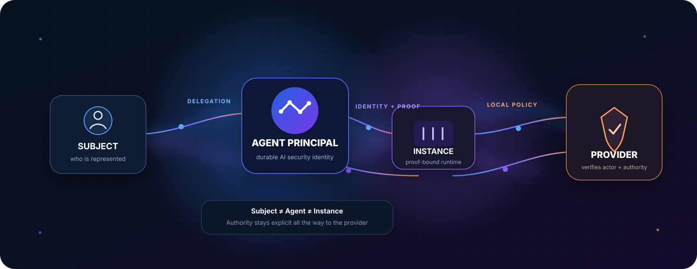

<p align="center">
  
</p>

<h1 align="center">AgentAuth</h1>

<p align="center">
  <strong>AI can act for you without becoming you.</strong>
</p>

<p align="center">
  First-class identity and delegated authority for AI agents
</p>

<p align="center">
  <a href="https://github.com/imMamdouhaboammar/agent-auth-protocol/actions"></a>
  <a href="./docs/24-normative-protocol-core.md"></a>
  <a href="./LICENSE"></a>
  <a href="./LICENSE-DOCS.md"></a>
  <a href="./CITATION.cff"></a>
</p>

<p align="center">
  <a href="./docs/index.html">Guide</a>
  ·
  <a href="./docs/24-normative-protocol-core.md">Protocol</a>
  ·
  <a href="./docs/31-conformance-matrix.md">Conformance</a>
  ·
  <a href="./HOW_TO_CITE.md">Cite</a>
</p>

---

AgentAuth is an open system design for **AI agent authentication**, identity, authorization, delegation, federation, runtime attestation, and native **Login as Agent**.

OAuth and MCP can already let an AI client access a user's account. AgentAuth keeps one more security fact alive all the way to the Provider:

> **Which AI agent is actually acting, from which runtime, for whom, and under what authority?**

The goal is not to replace OAuth, OpenID Connect, MCP, SPIFFE, DPoP, mTLS, RATS, or EAT. AgentAuth profiles and connects those mechanisms so the AI actor does not disappear behind the user account or client application.

## The problem in one picture

A common integration can look like this:

```text
User
  |
  | OAuth consent
  v
AI Client
  |
  | user-scoped access token
  v
Service

Service can often identify:
  user + OAuth client
```

AgentAuth keeps the agent itself explicit:

```text
Represented Subject
       |
       | delegates authority
       v
Agent Principal
       |
       | runs as
       v
Agent Instance
       |
       | proof-bound credential
       v
Provider

Provider can retain:
  Subject + Agent + Instance + Grant + Proof
```

That difference matters when the human has broad access but the agent should not.

For example:

```text
Subject authority:
  repo.read
  repo.write
  repo.delete

Agent grant:
  repo.read
  repo.write

Runtime restriction:
  repo.read

Effective authority:
  repo.read
```

The user may be allowed to delete the repository. The agent still is not.

## What AgentAuth makes first-class

| Security object | Meaning |
| --- | --- |
| **Subject** | The human, organization, workload, or agent being represented |
| **Agent Principal** | The durable security identity of the AI agent |
| **Agent Instance** | One running instance with its own proof key |
| **Delegation Grant** | Explicit, scoped, time-bounded authority |
| **Provider Agent Account** | Provider-local relationship to an issuer-qualified agent |
| **AgentAuth Context** | Trusted Provider-side context after validation |
| **Agent Session** | A Provider session that remains visibly agent-operated |

Global Agent identity is issuer-qualified:

```text
Agent Principal = (agent_issuer, agent_id)
Agent Instance  = (agent_issuer, instance_id)
```

A bare `agent_id` is not a global identity.

## What changes compared with ordinary OAuth/MCP access?

| Question | Typical OAuth/MCP integration | AgentAuth |
| --- | --- | --- |
| Who is the user or represented subject? | Usually explicit | Explicit |
| Which client application connected? | Usually explicit through `client_id` | Still available |
| Which AI Agent Principal is acting? | Not consistently first-class | Explicit |
| Which running agent instance is acting? | Usually outside the auth model | Explicit |
| Is the agent acting for itself or for someone else? | Often inferred from the flow | Explicit authority mode |
| Where did the authority come from? | Scopes, consent, app policy | Grant + Subject authority + Provider policy |
| Can one agent delegate to another? | External to the basic flow | First-class, attenuation required |
| Does runtime attestation affect trust? | Usually external | Explicit trust input |
| Does the Provider keep an agent-aware session? | Not guaranteed | Native profile supports it |

The distinction is deliberate:

```text
OAuth Client
    !=
Agent Principal
    !=
Agent Instance
    !=
Represented Subject
```

## Native Login as Agent

**Login as Agent** is a Provider flow where the target intentionally accepts an AI Agent Actor and preserves that fact in authorization and session state.

A native AgentAuth login can preserve:

```text
Subject        = represented principal
Actor          = AI Agent Principal
Instance       = current runtime
Grant          = authority basis
Proof          = sender-constrained proof
Session        = Provider-local agent session
```

It is not browser automation pretending to be a human login. It is not a special User-Agent string. It is not an `X-Agent: true` header.

The Provider knows the AI actor exists.

Read [Native Login as Agent](docs/05-native-login-as-agent.md) and [Protocol Ceremonies](docs/20-protocol-ceremonies.md).

## Authorization is an intersection

For delegated access, AgentAuth computes authority by narrowing:

```text
Requested Authority
INTERSECT Subject Authority
INTERSECT Delegation Grant
INTERSECT Agent Local Authority
INTERSECT Provider Policy Allow
INTERSECT Runtime Authority
MINUS Provider Policy Deny
```

One broad permission source cannot restore authority removed by another layer.

Portable grants use positive Capabilities and deterministic constraints. Provider-local RBAC, ReBAC, ABAC, ACLs, Cedar, OPA, OpenFGA, or custom business rules remain Provider policy inputs.

Read:

- [Effective Authorization Model](docs/32-effective-authorization-model.md)
- [Capability Grammar](docs/33-capability-grammar.md)
- [Constraint Algebra](docs/34-constraint-algebra.md)
- [Delegation and Attenuation](docs/35-delegation-attenuation.md)
- [Progressive Consent](docs/37-progressive-consent.md)

## Trust stays separate from permission

AgentAuth does not collapse cryptographic validity, federation trust, runtime assurance, and action authorization.

```text
Valid signature
    !=
Trusted issuer
    !=
Trusted Agent Instance
    !=
Attested runtime
    !=
Authorized action
```

Federation is explicit, directional, bounded, revocable, and non-transitive by default.

Runtime attestation can satisfy a Provider trust requirement. It cannot expand a grant.

Read:

- [Trust Domain Model](docs/40-trust-domain-model.md)
- [Federation Protocol](docs/41-federation-protocol.md)
- [Agent Instance Enrollment](docs/42-agent-instance-enrollment.md)
- [Runtime Attestation](docs/43-runtime-attestation.md)
- [Key Lifecycle](docs/44-key-lifecycle.md)
- [Federated Token Exchange](docs/45-federated-token-exchange.md)
- [SPIFFE and Workload Identity Bridge](docs/47-spiffe-workload-bridge.md)

## How AgentAuth fits with existing standards

AgentAuth is designed as an identity and delegation profile above existing security building blocks.

```text
OAuth / OIDC / Token Exchange
        |
        | token issuance and delegation mechanics
        v
DPoP / mTLS
        |
        | sender-constrained proof
        v
AgentAuth
        |
        | Agent Principal + Instance + Subject + Grant
        v
API / MCP / Native Browser Session

SPIFFE / RATS / EAT
        |
        +--> workload identity and runtime trust inputs
```

Stable foundations include OAuth 2.0, OAuth Security BCP, RFC 8693 Token Exchange, RFC 8705 mTLS, RFC 9449 DPoP, RFC 9068 JWT access-token profile, RFC 8707 Resource Indicators, RFC 8414 Authorization Server Metadata, RFC 9728 Protected Resource Metadata, RFC 9396 Rich Authorization Requests, OpenID Connect, RFC 9334 RATS, RFC 9711 EAT, RFC 9782 EAT media types, RFC 10013 measured components, and SPIFFE concepts.

Emerging AI-agent and workload-identity drafts are tracked as research inputs until they stabilize.

See [Standards Mapping](docs/16-standards-mapping.md).

## System design map

AgentAuth v0.2 is still in the **System Design** phase. The repository is intentionally freezing semantics before a production reference implementation.

| Area | Start here |
| --- | --- |
| Product and requirements | [Product Vision](docs/00-product-vision.md) |
| Domain language | [CONTEXT.md](CONTEXT.md) |
| Architecture | [Three-Party Architecture](docs/17-three-party-protocol-architecture.md) |
| Protocol | [Normative Protocol Core](docs/24-normative-protocol-core.md) |
| Wire format | [HTTP Wire Bindings](docs/25-http-wire-bindings.md) |
| Claims | [Token and Claims Profile](docs/26-token-and-claims-profile.md) |
| Discovery | [Discovery and Metadata](docs/21-discovery-and-metadata.md) |
| Authorization | [Effective Authorization Model](docs/32-effective-authorization-model.md) |
| Delegation | [Delegation and Attenuation](docs/35-delegation-attenuation.md) |
| Trust | [Trust Domain Model](docs/40-trust-domain-model.md) |
| Federation | [Federation Protocol](docs/41-federation-protocol.md) |
| Attestation | [Runtime Attestation](docs/43-runtime-attestation.md) |
| Conformance | [Conformance Matrix](docs/31-conformance-matrix.md) |
| Security | [Threat Model](docs/09-security-threat-model.md) |
| Decisions | [ADRs](docs/adr/) |

For a shorter public entry point, see [AgentAuth Documentation](docs/index.html).

## For AI agents working on this repository

Read [AGENTS.md](AGENTS.md) before modifying protocol semantics, schemas, security claims, tests, or publication artifacts.

It defines the source-of-truth order, protocol invariants, standards policy, change workflow, test expectations, and rules for research and implementation agents.

## Verification

```bash
bun install
bun test
bun run validate:checksums
```

CI validates schemas, conformance fixtures, protocol design documents, publication artifacts, and SHA-256 integrity.

## Citation, authorship, and reuse

**Canonical source:** https://github.com/imMamdouhaboammar/agent-auth-protocol  
**Original system design:** Mamdouh Aboammar  
**Current design:** AgentAuth v0.2 draft

Preferred citation:

> Mamdouh Aboammar. *AgentAuth Protocol v0.2: System Design for AI Agent Identity, Authentication, Authorization, Delegation, Federation, and Attestation.* 2026.

See [CITATION.cff](CITATION.cff), [Design Provenance](DESIGN_PROVENANCE.md), and [How to Cite AgentAuth](HOW_TO_CITE.md).

### Licensing

- Software, tests, schemas, and reference implementation material: **Apache-2.0**
- Original documentation prose and diagrams: **CC BY 4.0**

If you implement AgentAuth from this design, the project requests that you cite the canonical repository as technical provenance. Reuse of licensed documentation remains subject to the applicable attribution requirements.

See [LICENSE](LICENSE), [LICENSE-DOCS.md](LICENSE-DOCS.md), and [ATTRIBUTION.md](ATTRIBUTION.md).

---

<p align="center">
  <strong>AgentAuth v0.2 Draft</strong><br>
  Identity stays explicit. Authority stays bounded.
</p>
