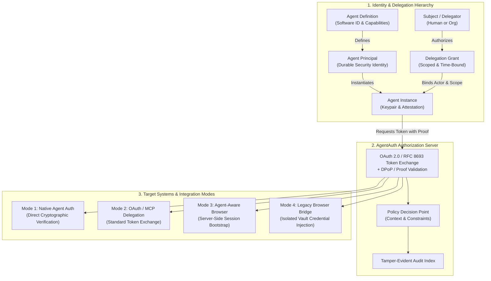

# AgentAuth Protocol & Platform

[](https://github.com/imMamdouhaboammar/agent-auth-protocol/actions)
[](LICENSE)
[](docs/00-product-vision.md)
[](https://bun.sh)
[](docs/16-standards-mapping.md)

**Status:** Draft system design v0.1  
**Date:** 2026-10-05  

---

## Purpose

AgentAuth is a deployable authentication, authorization, delegation, and audit system for AI agents.

The core problem is not browser automation. The core problem is identity:

- a service must be able to distinguish a human, a traditional workload, and an AI agent
- an AI agent must have its own cryptographic identity
- an agent acting for a human or organization must carry explicit delegated authority
- the delegated authority must be narrower than the delegator's authority
- every privileged action must be attributable to the human or organization, the agent, the running agent instance, and the grant that authorized the action
- browser, API, MCP, and agent-to-agent access must converge on the same identity and policy model
- the platform must be deployable globally, regionally, on-premises, or in sovereign environments without requiring one global central root

This package specifies the product, trust model, protocols, browser integration, MCP integration, policy model, threat model, data model, deployment model, testing strategy, and implementation work graph.

---

## Architecture Overview



---

## Design Position

AgentAuth is intentionally built on existing identity standards instead of inventing a parallel authentication stack.

Core standards used by the design:

- **OAuth 2.0 and the OAuth 2.0 Security Best Current Practice**
- **OpenID Connect** where identity assertions are required
- **OAuth 2.0 Token Exchange (RFC 8693)** for delegation
- **DPoP (RFC 9449) or mTLS (RFC 8705)** for sender-constrained tokens
- **Rich Authorization Requests (RAR / RFC 9396)** for structured authorization details
- **JWT access token profiles** where self-contained tokens are appropriate
- **SPIFFE** concepts for workload identity and federated trust domains
- **Model Context Protocol (MCP)** authorization as an integration profile, not as the core identity model

Emerging AI-agent identity drafts are treated as research inputs, not stable dependencies.

---

## The Most Important Distinction

AgentAuth separates five entities that are commonly collapsed into "the agent":

1. **Agent Definition**: the registered software identity and declared capabilities.
2. **Agent Principal**: the durable security principal used in authorization.
3. **Agent Instance**: one running copy of an agent with its own key and runtime evidence.
4. **Delegator or Subject**: the human, organization, or workload on whose behalf the agent may act.
5. **Execution Session**: a short-lived, audience-bound authorization context derived from a grant.

This separation is the basis for revocation, audit, multi-agent delegation, runtime compromise recovery, and target-side disclosure.

---

## Access Modes

AgentAuth supports four access modes:

### 1. Native Agent Auth
The target application directly verifies AgentAuth credentials and sees an explicit agent actor. This is the highest-assurance path.

### 2. OAuth/OIDC or MCP Delegation
The target accepts standards-based access tokens. AgentAuth uses token exchange and structured authorization to represent the human or organization as subject and the AI agent as actor.

### 3. Agent-Aware Browser Session
The target application adds an agent session bootstrap endpoint or AgentAuth SDK. The agent exchanges a verified access token for a browser session whose server-side session record is marked as an AI agent session.

### 4. Legacy Browser Bridge
A managed browser interacts with a target that has no AgentAuth integration. AgentAuth can still protect credentials, bind the runtime, enforce coarse policy, and keep a complete audit trail. It cannot truthfully claim the target application itself knows the caller is an AI agent unless the target cooperates.

---

## Global Deployment Model

AgentAuth uses regional or organizational trust domains. A deployment may be:

- public multi-tenant SaaS
- dedicated single-tenant cloud
- regional cell
- sovereign cloud
- on-premises Kubernetes
- private data center

Federation is explicit. No mandatory global control plane is required.

---

## Package Map

| Specification Document | Focus Area |
| :--- | :--- |
| [`CONTEXT.md`](CONTEXT.md) | Canonical domain language |
| [`docs/00-product-vision.md`](docs/00-product-vision.md) | Product scope and success criteria |
| [`docs/01-requirements.md`](docs/01-requirements.md) | Normative requirements |
| [`docs/02-domain-model.md`](docs/02-domain-model.md) | Entities, invariants, and state machines |
| [`docs/03-system-architecture.md`](docs/03-system-architecture.md) | Logical architecture and trust boundaries |
| [`docs/04-protocol-design.md`](docs/04-protocol-design.md) | Token and protocol profiles |
| [`docs/05-native-login-as-agent.md`](docs/05-native-login-as-agent.md) | Native browser login flow |
| [`docs/06-browser-bridge.md`](docs/06-browser-bridge.md) | Legacy browser compatibility |
| [`docs/07-mcp-api-integration.md`](docs/07-mcp-api-integration.md) | MCP and API integration |
| [`docs/08-policy-consent-delegation.md`](docs/08-policy-consent-delegation.md) | Consent, authorization, and delegation |
| [`docs/09-security-threat-model.md`](docs/09-security-threat-model.md) | Threat model and security controls |
| [`docs/10-data-model.md`](docs/10-data-model.md) | Persistence model |
| [`docs/11-deployment-federation.md`](docs/11-deployment-federation.md) | Global deployment and federation |
| [`docs/12-observability-audit.md`](docs/12-observability-audit.md) | Audit and operational telemetry |
| [`docs/13-test-conformance.md`](docs/13-test-conformance.md) | Conformance and verification suite |
| [`docs/14-roadmap.md`](docs/14-roadmap.md) | Staged product roadmap |
| [`docs/15-operations-runbook.md`](docs/15-operations-runbook.md) | Operational requirements |
| [`docs/16-standards-mapping.md`](docs/16-standards-mapping.md) | Standards status and design mapping |
| [`docs/adr/`](docs/adr/) | Architectural Decision Records |
| [`api/openapi.yaml`](api/openapi.yaml) | Public management and integration API draft |
| [`schemas/`](schemas/) | Machine-readable JSON Schemas (Draft 2020-12) |
| [`examples/`](examples/) | Worked token and flow examples |
| [`security/`](security/) | Abuse cases and privacy requirements |
| [`goals/ZZZOPS_GOAL_DAG.md`](goals/ZZZOPS_GOAL_DAG.md) | Implementation outcome DAG |
| [`implementation/PLAN.md`](implementation/PLAN.md) | Implementation plan |
| [`deploy/reference-topology.md`](deploy/reference-topology.md) | Reference deployment topology |

---

## Local Verification & Tooling

This repository uses **[Bun](https://bun.sh)** for schema validation, OpenAPI integrity, and test automation.

```bash
# 1. Install dependencies
bun install

# 2. Run automated test suite
bun test

# 3. Verify specification cryptographic checksums
bun run validate:checksums
```

---

## Normative Language

The terms MUST, MUST NOT, SHOULD, SHOULD NOT, and MAY are used as design requirements inside this package. This document is a product specification, not an Internet standard.

---

## Non-goals

The first implementation does not attempt to:

- bypass CAPTCHAs or anti-bot controls
- conceal that a caller is an agent from an integrated target
- make a non-integrated target magically aware of agent identity
- store passwords or refresh tokens inside model context
- create a global mandatory identity root
- replace enterprise IdPs
- grant an agent every permission the user has
- infer authorization directly from natural-language prompts
- treat a browser cookie as durable identity
- rely on a single model vendor or agent framework

---

## Governance & Community

- [Contributing Guidelines](CONTRIBUTING.md)
- [Code of Conduct](CODE_OF_CONDUCT.md)
- [Security Policy & Vulnerability Disclosure](SECURITY.md)
- [Apache 2.0 License](LICENSE)
