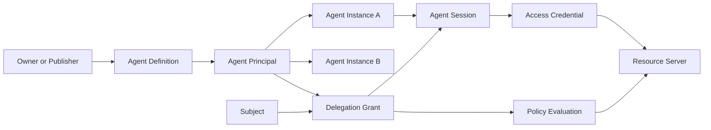
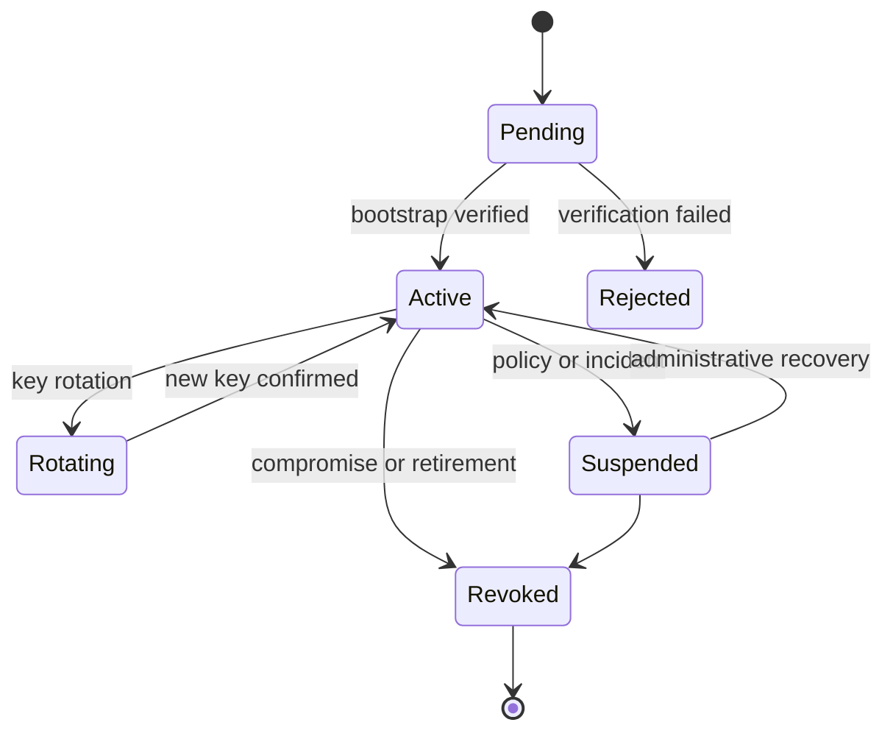

# Domain Model

## Entity graph



## Agent Definition

Fields:

- `agent_definition_id`
- publisher identity
- display name
- software version policy
- declared integration capabilities
- allowed runtime attestation classes
- metadata version
- status

The Agent Definition is descriptive and administrative. It is not a bearer of permissions.

## Agent Principal

Fields:

- `agent_id`
- issuer or Trust Domain
- parent Agent Definition
- owner tenant
- status
- trust metadata
- allowed delegation depth ceiling
- created and disabled timestamps

Security invariant:

Deleting or changing the display metadata of an Agent Definition MUST NOT silently change the security identity of the Agent Principal.

## Agent Instance

Fields:

- `instance_id`
- `agent_id`
- public proof key
- optional workload identity
- optional attestation evidence reference
- runtime class
- region
- first seen
- last seen
- status

Lifecycle:



An Agent Instance is the unit of runtime compromise response.

## Delegation Grant

A grant is not an access token. It is durable, revocable authorization state from which short-lived credentials are derived.

Core fields:

- `grant_id`
- `issuer`
- `subject`
- `actor_agent_id`
- `parent_grant_id` if delegated by another agent
- `resource_selectors`
- `capabilities`
- `constraints`
- `not_before`
- `expires_at`
- `max_delegation_depth`
- `approval_mode`
- `status`
- `policy_snapshot_ref`
- `created_by`
- `approved_by`
- `revoked_at`
- `revocation_reason`

### Attenuation rule

For child grant `C` derived from parent `P`:

- `C.resources` MUST be a subset of `P.resources`
- `C.actions` MUST be a subset of `P.actions`
- `C.expiry` MUST be no later than `P.expiry`
- `C.constraints` MUST be equal or stricter
- `C.max_delegation_depth` MUST be lower
- `C.subject` MUST remain within the subject relationship allowed by `P`
- `C` MUST NOT remove a mandatory step-up condition inherited from `P`

The attenuation evaluator is a security-critical deep module and should be property-tested.

## Capability

A capability is represented as:

```json
{
  "action": "payment.create",
  "resources": ["urn:bank:account:123"],
  "constraints": {
    "max_amount": {"currency": "USD", "value": "500.00"},
    "recipient_allowlist": ["urn:payee:vendor-42"],
    "requires_approval_over": {"currency": "USD", "value": "100.00"}
  }
}
```

Capability semantics are resource-specific. AgentAuth defines the envelope and comparison rules, while each integration profile defines action vocabularies and constraint types.

## Action Intent

Action Intent is a normalized pre-execution object.

Example:

```json
{
  "action": "email.send",
  "resource": "urn:mailbox:user-7",
  "parameters": {
    "to": ["finance@example.test"],
    "attachment_classes": ["internal"]
  },
  "purpose": "invoice-follow-up",
  "requested_at": "2026-10-05T10:00:00Z"
}
```

The model can propose an Action Intent, but an enforcement point must validate it.

## Action Digest

The digest binds approval to the exact security-relevant representation:

1. Normalize using deterministic JSON canonicalization.
2. Exclude non-security metadata such as UI labels.
3. Hash with a modern cryptographic hash.
4. Store the digest in approval evidence and audit events.

Any change to recipient, amount, target resource, or action invalidates the approval.

## Trust tiers

The system may expose a tenant-defined trust tier, but trust tiers MUST NOT be treated as global facts.

Suggested local tiers:

- T0: registered Agent Principal, no runtime key assurance
- T1: instance key proven and sender-constrained
- T2: workload identity verified
- T3: hardware or confidential-compute attestation verified

A Resource Server can require a minimum tier for specific actions.

## Direct and delegated authority

### Direct Agent Authority

Use when an organization grants an agent its own privileges.

Security representation:

- token subject is the Agent Principal
- no human delegation is implied
- audit still records owner and Agent Instance

### Delegated Agent Authority

Use when an agent acts for a human or organization.

Security representation:

- token top-level subject identifies the represented Subject
- token actor identifies the Agent Principal
- AgentAuth extension claims identify Agent Instance and grant

This mirrors established OAuth delegation semantics and prevents loss of accountability.
