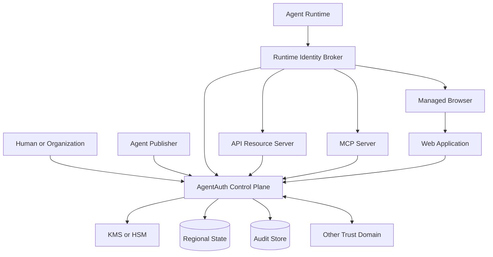

# System Architecture

## Architecture goal

Keep identity, delegation, policy, and audit coherent while allowing API, MCP, browser, and agent-to-agent access to use different adapters.

The architecture is split into four planes.

## 1. Trust plane

Responsibilities:

- Trust Domain identity
- signing keys
- key rotation
- JWKS publication
- workload identity integration
- Agent Instance bootstrap
- optional runtime attestation
- federation metadata

Core modules:

- Trust Domain Manager
- Key Authority
- Instance Attestation Verifier
- Federation Trust Store

## 2. Control plane

Responsibilities:

- Agent Registry
- grant lifecycle
- human and organization consent
- authorization server
- token exchange
- policy decision
- revocation
- administrative controls
- audit metadata

Recommended initial deployment is a modular control-plane application with deep internal modules, not a microservice per noun.

Logical modules:

- `registry`
- `grants`
- `authorization`
- `policy`
- `revocation`
- `audit`
- `federation`

Each module has one narrow public interface. Internal persistence details stay private.

## 3. Runtime plane

Responsibilities:

- hold Agent Instance proof key
- request credentials
- sign DPoP proofs or use mTLS
- protect refresh credentials
- translate agent action requests into structured Action Intents
- enforce local policy obligations
- broker MCP and API credentials
- request browser sessions

Components:

- Runtime Identity Broker
- Credential Vault Adapter
- Action Guard
- Browser Controller
- MCP/Auth Adapter

The language model never receives private keys or raw refresh credentials.

## 4. Resource plane

Responsibilities:

- validate access token
- verify proof binding
- identify Subject and Actor
- evaluate local authorization
- optionally call central PDP for contextual checks
- create native browser sessions
- emit resource-side audit evidence

Integration forms:

- application SDK
- API gateway plugin
- reverse proxy
- MCP server middleware
- native browser session endpoint

## Context diagram



## Trust boundaries

### TB-1: Human to control plane

Human authentication is delegated to an enterprise or consumer IdP where possible. AgentAuth should not become the primary password database.

### TB-2: Agent runtime to Runtime Identity Broker

The runtime proves possession of the Agent Instance key or local workload identity.

### TB-3: Runtime Identity Broker to authorization server

Mutually authenticated or sender-constrained credential exchange.

### TB-4: Resource Server to AgentAuth issuer

The Resource Server trusts selected issuer keys and metadata. Federation is explicit.

### TB-5: Model process to credential boundary

The model process is considered potentially influenced by untrusted content. Secrets stay across this boundary.

### TB-6: Managed browser to target

For native AgentAuth integration, the target verifies agent identity. For legacy mode, target awareness is not guaranteed.

## Reference module interfaces

### Registry

```text
register_agent(definition, owner) -> AgentPrincipal
register_instance(agent_id, proof_key, runtime_evidence) -> AgentInstance
rotate_instance_key(instance_id, new_proof_key, evidence) -> InstanceKeyVersion
disable_agent(agent_id, reason) -> Status
```

### Grants

```text
create_grant(subject, actor, authorization_details, constraints) -> PendingGrant
approve_grant(grant_id, approver, evidence) -> ActiveGrant
derive_grant(parent_grant_id, child_request) -> ActiveGrant
revoke_grant(grant_id, reason) -> RevocationResult
```

### Authorization

```text
exchange(subject_credential, actor_credential, audience, authorization_details, proof) -> AccessCredential
introspect(token_or_reference) -> ActiveAuthorization
```

### Policy

```text
decide(actor, subject, instance, grant, action_intent, context) -> PolicyDecision
```

### Session Broker

```text
create_native_browser_bootstrap(access_credential, target) -> OneTimeBootstrap
redeem_native_browser_bootstrap(code, proof) -> BrowserSession
```

## State ownership

Authoritative state:

- PostgreSQL or equivalent transactional relational store for registry, grants, policy metadata, revocation, and configuration
- KMS/HSM for issuer signing keys
- external object/WORM storage for signed audit batches
- cache may accelerate validation but MUST NOT become the only source of revocation truth

## Event propagation

Use a transactional outbox from authoritative state to publish:

- `agent.changed`
- `instance.revoked`
- `grant.approved`
- `grant.revoked`
- `policy.published`
- `key.rotated`

Consumers use idempotent event handlers.

## Failure strategy

### Control plane unavailable

Resource Servers MAY continue offline validation of unexpired low-risk access tokens according to tenant policy.

High-risk actions that require online policy or revocation freshness MUST fail closed.

### Revocation stream delayed

Tokens with short lifetimes limit exposure. High-risk integrations SHOULD use online introspection or a rapidly refreshed revocation feed.

### KMS unavailable

No new signed credentials are issued. Existing Resource Servers can validate already issued credentials using cached public keys.

### Regional connectivity loss

Each regional cell retains local validation and issuance capability for tenants assigned to that cell if its local key authority and database remain healthy.

## Why not microservices first

The core challenge is correctness of security invariants, not independent scaling of dozens of services.

A modular monolith with strict interfaces reduces:

- distributed transaction complexity
- policy and revocation races
- operational burden
- attack surface
- cross-service semantic drift

Service extraction should happen only when a real scaling or isolation boundary appears.
