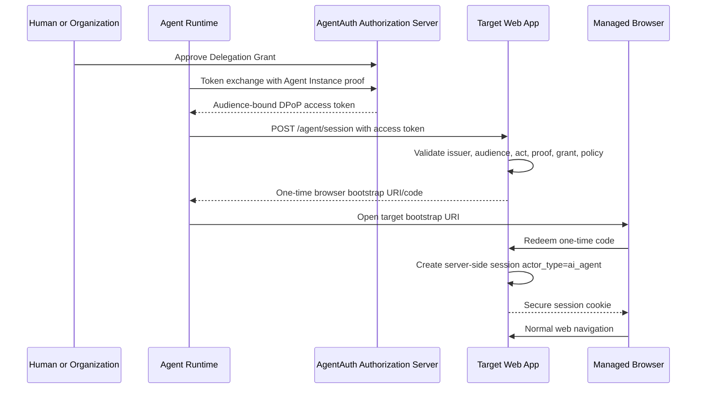

# Native Login as Agent

## Goal

Allow a web application to create a browser session for an AI agent while the application explicitly knows that the session is agent-operated.

This is different from an agent typing a user's password.

## Target integration contract

An AgentAuth-aware web application adds:

- AgentAuth issuer trust configuration
- an agent-session bootstrap endpoint
- server-side session actor metadata
- authorization middleware that can distinguish `human` and `ai_agent`
- audit fields for Agent Principal, Agent Instance, Subject, and Grant
- optional UI indicator that a session is agent-operated

## Flow



## Target endpoint

Conceptual interface:

```http
POST /agent/session
Authorization: DPoP <access-token>
DPoP: <proof>
Content-Type: application/json

{
  "return_path": "/dashboard",
  "requested_session_ttl_seconds": 900
}
```

Response:

```json
{
  "bootstrap_url": "https://app.example.com/agent/session/redeem?code=opaque-one-time-code",
  "expires_in": 60
}
```

## Server-side session record

Required fields:

- session id
- `actor_type = ai_agent`
- Agent Principal
- Agent Instance
- Subject, if delegated
- Grant identifier
- issuer
- trust tier
- authentication time
- expiry
- policy context version
- revocation check mode

The browser cookie should contain only an opaque session identifier where practical.

## Authorization behavior

The target application may choose different policy for agent sessions.

Examples:

- allow read-only access but block account recovery
- require step-up for money movement
- prevent changing the user's MFA settings
- prevent creating long-lived API keys
- prevent exporting highly sensitive datasets
- expose a dedicated agent-safe UI route
- require explicit purpose-bound grants

These restrictions are target policy, not global AgentAuth defaults.

## Session lifecycle

### Creation

A session is created only after validating an AgentAuth credential.

### Renewal

Renewal must revalidate agent and grant state. Long browser sessions should not outlive the underlying grant.

### Revocation

The target can consume revocation events or periodically introspect. High-risk sessions should be terminated quickly after:

- Agent Principal disablement
- Agent Instance revocation
- grant revocation
- policy emergency action

### Human handoff

A target may return `step_up_required`. The browser should pause at a safe point and direct approval to a human channel rather than exposing human credentials to the agent.

## Web application UX

Recommended visible indicators:

- "AI agent session" badge
- acting agent name
- represented user or organization
- granted purpose
- session expiry
- link to revoke grant

The user should be able to distinguish:

- actions they performed
- actions the agent performed for them
- actions another agent delegated to this agent

## Compatibility

An application does not need to replace its existing human login flow.

Human login and AgentAuth coexist:

```text
Human:
OIDC login -> human session

Agent:
AgentAuth token -> agent-session bootstrap -> agent session
```

Both may use the same application authorization engine, but actor metadata MUST remain distinct.
