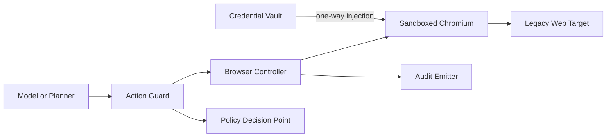

# Legacy Browser Bridge

## Purpose

The Browser Bridge exists for applications that do not provide APIs, MCP, or native AgentAuth integration.

It is a compatibility system, not a claim that the target has native agent identity support.

## Assurance levels

### Browser B0: legacy opaque target

The target sees an ordinary browser session. AgentAuth provides:

- isolated browser runtime
- protected credential injection
- session containment
- domain allowlist
- coarse action controls
- screenshots and audit evidence according to policy
- kill switch
- human handoff

The target itself does not reliably know the caller is an AI agent.

### Browser B1: trusted reverse proxy

A target is behind a trusted AgentAuth gateway.

The gateway validates AgentAuth identity, strips spoofable incoming identity headers, and injects trusted actor context toward the application.

The application can distinguish agent sessions without implementing token validation itself.

### Browser B2: native session bootstrap

The target implements the native AgentAuth browser profile described in `05-native-login-as-agent.md`.

This is the preferred browser mode.

## Architecture

## Credential handling

Credentials are never returned to the language model.

Credential flow:

1. browser controller requests a credential handle
2. policy checks target origin and Agent Instance
3. vault returns secret material only to a trusted browser injection process
4. secret is entered into the target login field or supplied through platform credential APIs
5. browser controller redacts sensitive input from logs and screenshots
6. vault handle expires
7. session cookies are stored in an encrypted target-specific profile

## Browser isolation

Each high-assurance session SHOULD have:

- dedicated OS/container sandbox
- dedicated browser profile
- outbound network policy
- target-domain allowlist where possible
- filesystem restrictions
- no shared clipboard
- no host credential stores
- no unrestricted extension installation
- no cross-tenant profile reuse

## Action Guard

Generic browser pages do not expose a universal semantic authorization API.

Therefore the Action Guard must use layered controls:

### Layer 1: origin policy

Which domains and subdomains may be reached.

### Layer 2: navigation policy

Block or require approval for transitions to unapproved domains.

### Layer 3: known action adapters

For supported targets, map UI interactions to structured Action Intents such as:

- `email.send`
- `crm.contact.update`
- `invoice.approve`
- `payment.create`

### Layer 4: generic sensitive-action heuristics

When no adapter exists, detect high-risk patterns conservatively:

- password or MFA change
- new API key
- money movement
- destructive delete
- permission changes
- external sharing
- mass download
- submission of highly sensitive data

Heuristics may trigger step-up but MUST NOT be treated as perfect semantic understanding.

## Prompt injection control

Content rendered by a website is untrusted.

The Browser Bridge SHOULD:

- separate page content from policy instructions
- never let page text modify the active Delegation Grant
- require policy approval for tool calls derived from page content
- block page content from requesting credential export
- bind human approval to normalized Action Digest, not to a vague prompt
- preserve provenance of which page or element caused a proposed action

## Login behavior

Preferred order:

1. native AgentAuth session
2. target OAuth or enterprise SSO with delegated authorization
3. passwordless target login mediated by human
4. vault-injected legacy credentials as last resort

## CAPTCHA and anti-bot controls

The Browser Bridge MUST NOT automate CAPTCHA bypass or attempt to evade explicit anti-automation controls.

Behavior:

- pause
- emit `human_handoff_required`
- preserve current safe state
- allow authorized human intervention
- resume only after the challenge is legitimately completed

## Cookie handling

- cookies encrypted at rest
- one tenant boundary
- one target profile
- explicit expiry
- invalidated on grant or instance revocation where feasible
- never included in LLM prompts
- never logged
- export disabled by default

## Browser evidence

Policy may capture:

- URL
- page title
- selected DOM metadata
- redacted screenshot
- action adapter output
- approval evidence
- result confirmation

Sensitive fields must be redacted before persistence.

## Hard limitation

Without target cooperation, no browser technology can guarantee that the target records "AI agent" as the actor.

AgentAuth can guarantee its own runtime identity, policy, credential custody, and audit. Target-side agent awareness begins at B1 or B2.
