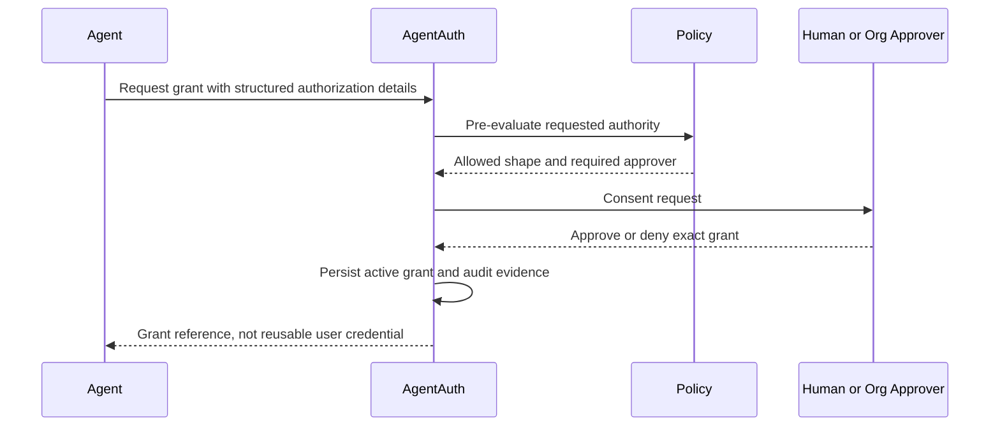

# Policy, Consent, and Delegation

## Separation of concerns

Consent answers: what authority did a human or organization intentionally grant?

Policy answers: may this action happen now under current security rules?

Both are required.

A valid grant does not force policy to allow an action.

## Grant structure

A grant contains:

- Subject
- Agent Actor
- resources
- capabilities
- constraints
- purpose
- validity window
- delegation depth
- approval requirements
- revocation state

## Consent UX requirements

Consent screens MUST show structured facts, not only technical scopes.

Example:

```text
Agent: Finance Assistant
Acting for: Acme Finance Team
Can:
- Read invoices in Workspace A
- Create payments from Account 123
Limits:
- Maximum 500 USD per payment
- Only approved vendor recipients
- Human approval required above 100 USD
Expires:
- 30 days
Can delegate:
- No
```

Avoid prompts such as "Allow full account access".

## Grant creation flow



## Policy inputs

Minimum:

- tenant
- Subject
- Actor
- Agent Instance
- runtime trust tier
- grant
- requested Action Intent
- Resource
- time
- risk signals
- source region
- policy version
- prior approval evidence

Optional:

- data classification
- anomaly score
- external fraud signal
- device posture
- business workflow state

## Policy outputs

```json
{
  "decision": "step_up",
  "reason_codes": [
    "AMOUNT_ABOVE_AUTONOMOUS_LIMIT"
  ],
  "obligations": [
    {
      "type": "human_approval",
      "bind_to_action_digest": true,
      "expires_in_seconds": 300
    }
  ],
  "policy_version": "pol_2026_10_05_7"
}
```

## Transaction-bound approval

For sensitive actions, approval is bound to:

- action
- target Resource
- relevant parameters
- Subject
- Actor
- grant
- expiry

Example:

```text
Approve Finance Assistant to pay Vendor 42 exactly 250 USD from Account 123.
```

If the amount or recipient changes, approval is invalid.

## Multi-agent delegation

A parent agent may delegate only if the active grant explicitly permits it.

Child grant creation must pass the attenuation checker.

### Attenuation lattice

Constraints are compared by type.

Examples:

- amount: lower maximum is stricter
- time: shorter interval is stricter
- allowlist: subset is stricter
- denylist: superset is stricter
- rate: lower rate is stricter
- data classes: subset is stricter
- delegation depth: smaller value is stricter

Unknown constraint types MUST fail closed unless a registered comparator exists.

## Purpose

Purpose is a policy input and audit attribute.

Purpose alone MUST NOT expand permissions.

A resource may require a purpose match, for example:

```text
customer_records.read allowed only when purpose in
["support-case", "account-review"]
```

## Emergency controls

Four kill switches:

1. tenant-wide
2. Agent Principal
3. Agent Instance
4. Delegation Grant

Emergency disablement must emit a high-severity audit event.

## Policy engine implementation boundary

The AgentAuth core defines:

- policy input contract
- decision contract
- obligations
- versioning
- fail-closed semantics

The first implementation may use a policy engine such as Cedar or OPA, but business policy language is an adapter choice rather than part of the AgentAuth protocol.
