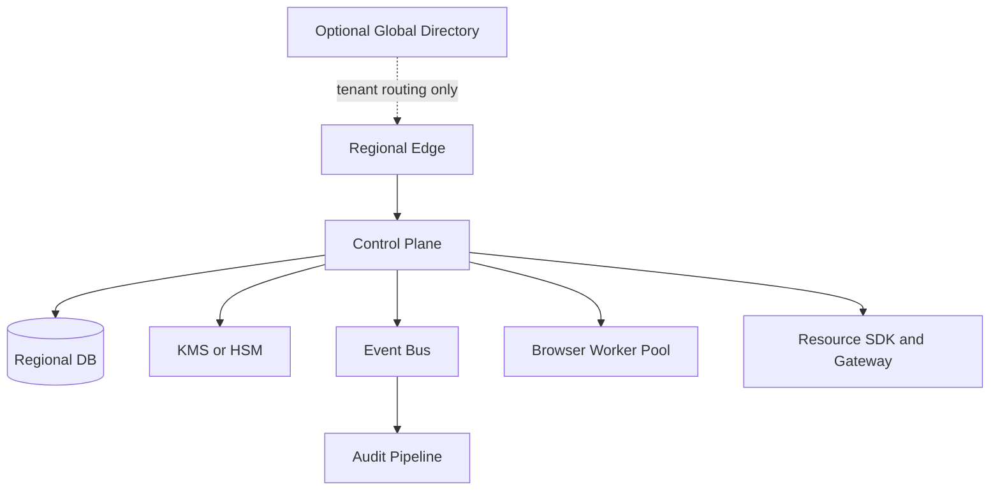

# Deployment and Federation

## Deployment objective

AgentAuth must be deployable anywhere without changing its security model.

Saudi Arabia, the EU, the US, a private data center, or a customer-owned cloud are deployment locations, not separate product architectures.

## Deployment shapes

### Shape A: multi-tenant regional SaaS

Per-region cell:

- API edge
- control plane replicas
- regional database
- regional KMS/HSM
- event bus
- audit pipeline
- regional browser workers
- observability stack

Global layer contains only low-sensitivity routing and tenant-home metadata where permitted.

### Shape B: dedicated tenant cloud

One customer receives:

- dedicated issuer
- dedicated database
- dedicated KMS keys
- dedicated browser worker pool
- federation to customer's IdP and workload identity

### Shape C: sovereign or regulated region

Everything required for identity, issuance, policy, audit, and browser execution stays in-region.

External dependencies must be optional or replaceable.

### Shape D: on-premises

Kubernetes or equivalent orchestration.

Required local dependencies:

- relational database
- key-management or HSM interface
- object storage
- ingress
- audit export

## Regional cell

## Data residency classes

Tenant configuration can classify data:

- R0: globally replicable metadata
- R1: region-bound operational metadata
- R2: region-bound identity and grants
- R3: highly restricted secrets and credentials
- R4: immutable local audit evidence

Cross-region replication policy is explicit per class.

## No mandatory global root

Each Trust Domain has its own issuer and keys.

Federation uses explicit trust.

Benefits:

- sovereign deployment
- blast-radius reduction
- independent key rotation
- organizational autonomy
- easier customer-managed installations

## Federation model

A Resource Server trusts:

- local Trust Domain
- zero or more explicitly configured external Trust Domains

Federation metadata includes:

- issuer
- JWKS URI
- supported AgentAuth profile version
- accepted actor types
- proof methods
- optional trust marks
- administrative contact metadata
- validity period

Trust policy includes:

- accepted audiences
- accepted agent owners or publishers
- required runtime assurance properties
- maximum delegation depth
- allowed actions
- whether external Subjects are accepted

No transitive federation by default.

The normative v0.2 trust and federation semantics are defined in:

- `docs/40-trust-domain-model.md`
- `docs/41-federation-protocol.md`
- `docs/44-key-lifecycle.md`
- `docs/45-federated-token-exchange.md`
- `docs/46-trust-decision-algorithm.md`
- `docs/47-spiffe-workload-bridge.md`

## SPIFFE integration

In environments that already use SPIFFE:

1. workload obtains SPIFFE identity
2. Runtime Identity Broker validates workload identity
3. workload identity is mapped to an Agent Instance
4. broker obtains AgentAuth resource credential
5. downstream Resource Server sees AgentAuth Subject and Actor semantics

SPIFFE remains workload identity. AgentAuth adds agent registration, delegation, authorization, and application-facing actor semantics.

A SPIFFE identity MUST be explicitly mapped to an Agent Principal. Valid workload identity alone does not authorize selection of an arbitrary Agent Principal.

## Key management

Per Trust Domain:

- signing keys in KMS/HSM
- separate encryption keys for secrets
- short rotation interval appropriate to provider
- overlapping JWKS publication
- emergency key disable process
- no direct private-key export in normal operations

## Browser workers

Browser execution is isolated from the control plane.

Recommended:

- ephemeral worker for high-risk tasks
- no inbound public access
- outbound egress policy
- credential injection over authenticated internal channel
- encrypted ephemeral disk
- automatic destruction after session
- separate pool per residency region

## Disaster recovery

Each cell must define:

- database recovery point objective
- recovery time objective
- KMS/HSM recovery process
- issuer key backup or replacement policy
- audit-store recovery
- grant revocation recovery
- browser worker recreation

A disaster-recovery region must not receive restricted tenant data unless configured.

## Federation failure

If external issuer metadata is unavailable:

- cached metadata may be used until configured expiry
- new trust must not be established
- expired or untrusted keys fail closed
- emergency trust revocation must override cache
