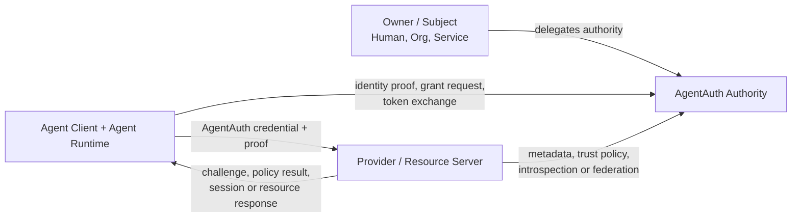

# Three-Party AgentAuth Protocol Architecture

## Status

Design slice: v0.2 draft.

This document sharpens AgentAuth from a platform-centric design into a protocol profile that can be implemented by independent vendors.

The protocol has three first-class parties:

1. the **Agent Client**, running with or beside an AI agent
2. the **AgentAuth Authority**, which authenticates agent identity and issues or exchanges authorization credentials
3. the **Provider**, the target application, API, SaaS product, MCP server, or web service that accepts agent-operated access

The Authority MAY be operated by the Provider, the agent operator, an enterprise identity team, a cloud platform, or an independent identity provider. The architecture does not require one global AgentAuth service.

## Core proposition

A Provider must be able to answer four separate questions:

- who is the represented Subject?
- which Agent Principal is acting?
- which Agent Instance is presenting this request now?
- what explicit authority allows this action?

A human session, an OAuth client identifier, a browser cookie, and an Agent Principal are not interchangeable identities.

## Protocol topology



The Agent Client and Provider SHOULD be able to interoperate without sharing implementation code. Their shared contract is the AgentAuth profile.

## Role 1: Agent Client

The Agent Client is the protocol-speaking security boundary used by an agent runtime.

Responsibilities:

- hold or reach the Agent Instance proof key without exposing it to model context
- identify the Agent Principal and Agent Instance
- discover Provider AgentAuth capabilities
- discover acceptable Authorities and proof methods
- obtain or present direct authority
- request delegated authority when acting for another Subject
- create DPoP proofs or use another negotiated proof-of-possession mechanism
- request API credentials or native browser sessions
- process step-up and consent requirements
- surface authorization failures to the runtime as structured results
- avoid silently falling back from agent-aware access to undisclosed human impersonation

The model MAY request an operation. The Agent Client decides how that operation is represented in the authentication and authorization protocol.

## Role 2: AgentAuth Authority

The Authority is the trust and authorization issuer.

It MAY combine OAuth Authorization Server, identity registry, delegation service, and policy decision functions in one deployment, or split them behind one issuer contract.

Responsibilities:

- register or federate Agent Principals
- register Agent Instances or accept trusted workload identity
- validate proof of possession
- authenticate Subjects through appropriate upstream IdPs
- persist or validate Delegation Grants
- issue audience-bound access credentials
- preserve Subject and Actor distinction
- publish keys and metadata
- provide revocation and introspection where required
- support federation without creating a mandatory global root

The Authority MUST NOT treat possession of a user credential as proof that a caller is an AI agent.

## Role 3: Provider

A Provider is the target that intentionally accepts agent access.

Responsibilities:

- publish AgentAuth capability metadata
- declare trusted Authority issuers or federation rules
- declare supported proof methods and integration profiles
- validate the agent-aware credential
- identify Actor, Subject, Agent Instance, and grant context
- map protocol capabilities to local permissions
- apply local Provider policy
- create an Agent Account or Native Agent Session when applicable
- retain the fact that the caller is an agent throughout the server-side session
- audit agent actions separately from human actions

A Provider is the final authority over its own resources. A valid AgentAuth token never forces a Provider to permit an action.

## Why there are two SDK surfaces, not two trust domains

Implementations will normally expose two developer-facing SDK families:

- **Agent SDK** for agent builders and runtimes
- **Provider SDK** for target applications and APIs

Those SDKs do not form a private bilateral tunnel. They implement one protocol profile around an Authority and existing OAuth trust machinery.

```text
Agent Runtime
    |
    v
Agent SDK
    |
    | AgentAuth profile
    v
Authority
    ^
    | AgentAuth profile
    |
Provider SDK
    ^
    |
Provider Application
```

A Provider MAY bundle the Authority into the same product. An enterprise MAY instead use an external Authority.

## Authentication modes

### Direct Agent Authority

The Agent Principal has privileges assigned directly to it.

Example:

```text
subject = agent_123
actor   = agent_123
```

Use cases:

- organization-owned automation
- background operations
- CI/CD agents
- agent-managed infrastructure

### Delegated Agent Authority

The agent acts for another Subject.

Example:

```text
subject = user_456
actor   = agent_123
instance = inst_789
grant   = grant_abc
```

Use cases:

- personal assistants
- finance assistants
- email agents
- customer-support agents

The Provider MUST be able to distinguish direct and delegated modes.

## Provider awareness levels

AgentAuth defines three awareness levels.

### A0: unaware

The target does not integrate AgentAuth. Browser automation may still occur, but the target cannot be said to know that an agent is acting.

### A1: gateway-aware

A trusted reverse proxy or gateway validates AgentAuth and injects authenticated actor context into a protected backend channel.

The backend relies on the gateway contract.

### A2: native-aware

The Provider application validates AgentAuth directly or through its Provider SDK and stores agent actor metadata in its own authorization/session model.

A2 is the preferred profile for Login as Agent.

## Identity layers

The protocol intentionally separates:

```text
Agent Definition
    -> Agent Principal
        -> Agent Instance
            -> Agent Session / Access Token
```

A Provider may authorize the Principal while requiring stronger controls for a specific Instance.

Examples:

- allow any active instance of an internal agent for read operations
- require hardware-backed attestation for payment operations
- revoke one compromised runtime without disabling the whole Agent Principal

## Signup is not the same as Authority registration

Two registrations can exist.

### Authority enrollment

Creates or recognizes the Agent Principal and Agent Instance at an Authority.

### Provider signup

Creates a Provider-local account or relationship for an already authenticated Agent Principal.

A Provider signup MUST NOT invent agent identity from an email address or browser fingerprint. It consumes identity evidence from an accepted Authority.

## Authentication is not authorization

Agent authentication proves the current runtime controls an accepted agent identity.

Authorization separately evaluates:

- direct entitlement or Delegation Grant
- requested Resource
- requested Action
- Provider policy
- runtime trust
- contextual risk
- required human approval

An authenticated agent may still receive zero usable permissions.

## Minimum protocol invariants

1. The Provider can identify an AI agent without relying on a User-Agent header.
2. Agent Instance proof is cryptographic.
3. Subject and Actor remain distinct under delegation.
4. Access credentials are audience restricted.
5. Provider policy can always narrow Authority-issued permissions.
6. Child delegation never expands parent authority.
7. Human credentials are not exposed to the model to make Login as Agent work.
8. Native Agent Sessions remain server-side distinguishable from human sessions.
9. No implementation requires a global AgentAuth root.
10. Legacy browser compatibility is never represented as native AgentAuth awareness.

## Relationship to OAuth

AgentAuth treats the Agent Client as an OAuth client or workload-like actor where appropriate, but adds explicit agent semantics.

The protocol profiles:

- Authorization Server metadata
- Protected Resource metadata
- Dynamic Client Registration where allowed
- Token Exchange for delegated authority
- Rich Authorization Requests for structured permissions
- DPoP or mTLS for sender-constrained access
- JWT access-token profiles
- OIDC for human identity and approval flows

Agent-specific metadata and claims remain versioned AgentAuth extensions until or unless equivalent standards mature.

## Conformance profiles

An implementation may claim one or more profiles:

- **AA-CLIENT-1**: Agent Client discovery and proof profile
- **AA-AUTHORITY-1**: Authority identity, delegation, and issuance profile
- **AA-PROVIDER-API-1**: Provider API validation profile
- **AA-PROVIDER-WEB-1**: Native Login as Agent session profile
- **AA-DELEGATION-1**: Subject/Actor and attenuation profile
- **AA-FEDERATION-1**: cross-Trust-Domain issuer acceptance profile

A complete native Login as Agent deployment requires AA-CLIENT-1 plus AA-PROVIDER-WEB-1 and access to a compatible Authority.

## Non-goals

This architecture does not require:

- a new transport protocol
- a new password format
- a central agent marketplace
- one universal policy language
- a mandatory blockchain or DID layer
- browser automation for systems that offer an API
- a target to trust every agent issuer
