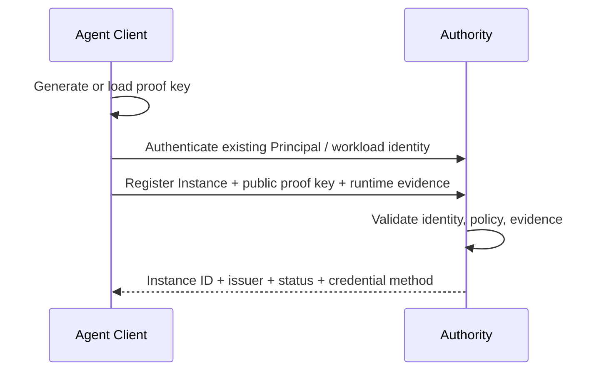
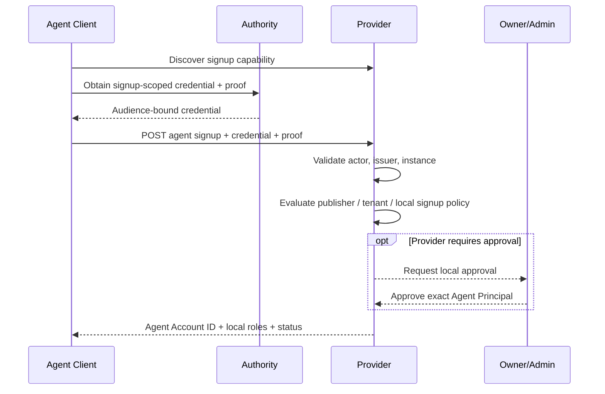
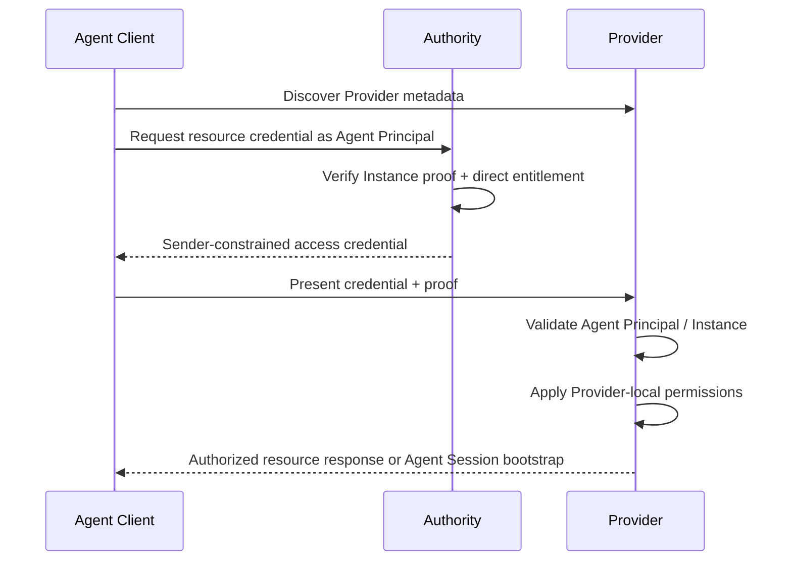
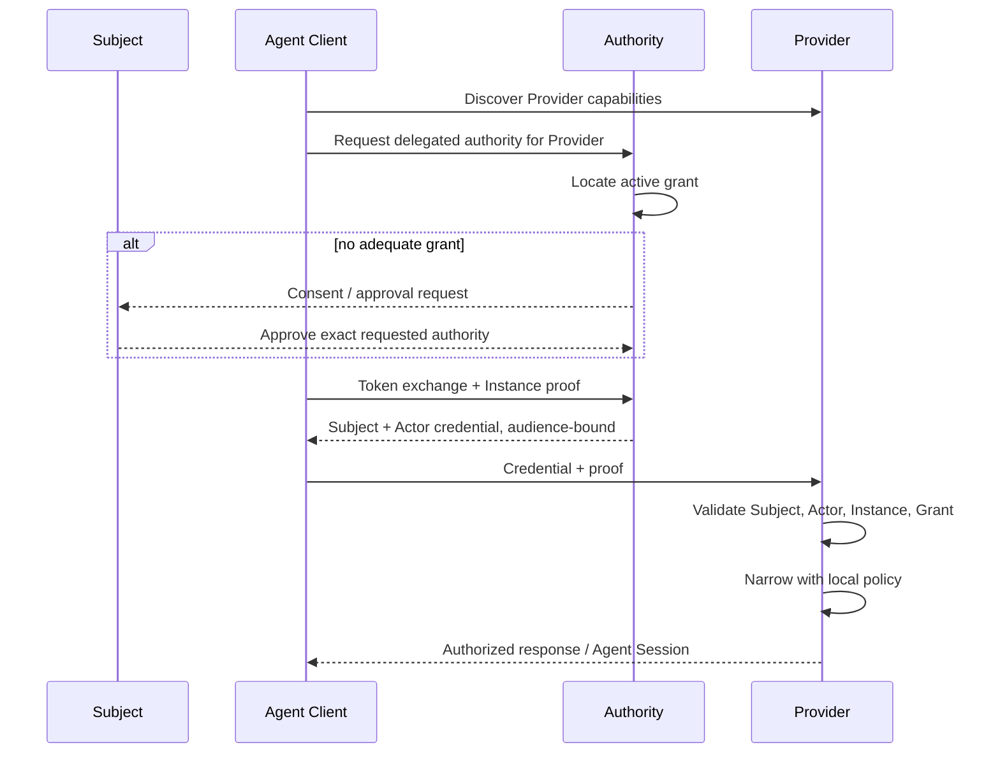
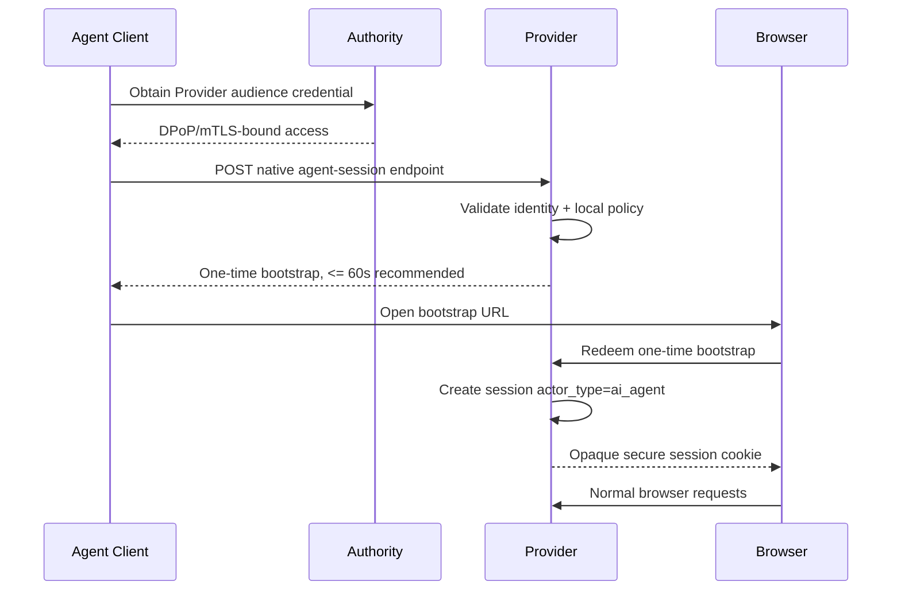
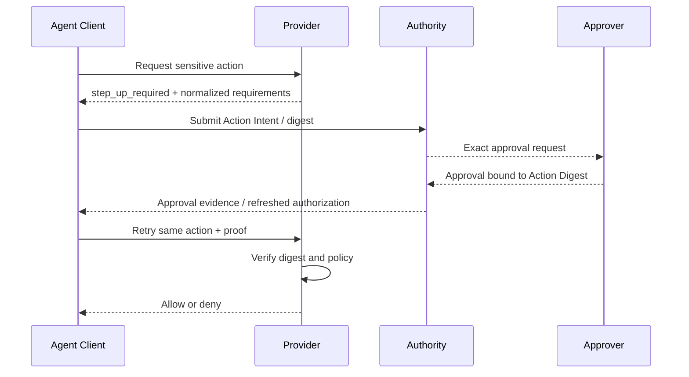

# AgentAuth Protocol Ceremonies

## Purpose

This document defines the protocol ceremonies that connect the Agent Client, AgentAuth Authority, Provider, and approving Subject.

The ceremonies are transport-compatible with HTTPS and OAuth-family mechanisms. Message bodies below are conceptual where an existing standard already defines the exact wire format.

## Actors

- **AC**: Agent Client
- **AU**: AgentAuth Authority
- **P**: Provider
- **S**: Subject or authorized approver
- **B**: Managed Browser

## Ceremony 0: Agent Instance enrollment

Goal: bind one running agent instance to a durable Agent Principal.



Required properties:

- no private key crosses the boundary
- one Instance can be revoked without revoking the Agent Principal
- enrollment does not itself create Provider permissions
- runtime attestation is optional unless policy requires it

## Ceremony 1: Provider discovery

Goal: learn whether a target intentionally accepts agents.

```text
AC -> P: GET protected resource metadata
P  -> AC: resource id, accepted authorities, AgentAuth profiles
AC -> AU: GET authorization server metadata
AU -> AC: endpoints, proof methods, AgentAuth extensions
AC: cross-check resource <-> authority declarations
```

Outcome:

- native agent-aware profile selected
- compatible API profile selected
- or `agentauth_not_supported`

The client MUST NOT infer support from UI text.

## Ceremony 2: Agent signup at a Provider

Goal: create a Provider-local Agent Account.

Prerequisite: the agent is already authenticated through an accepted Authority.



The Provider account maps to the Agent Principal. It MUST NOT be a synthetic human account.

Example request body:

```json
{
  "requested_profile": "standard-agent",
  "agent_metadata_uri": "https://publisher.example/agents/researcher.json",
  "terms_acceptance": {
    "mode": "owner-mediated"
  }
}
```

The credential, not the metadata URI, establishes identity.

## Ceremony 3: Direct agent login

Goal: authenticate an agent acting under its own Provider entitlement.



Security identity:

```text
subject = Agent Principal
actor   = Agent Principal
instance = current Agent Instance
authority_mode = direct
```

## Ceremony 4: Delegated agent login

Goal: let the Provider know both the represented Subject and the AI agent Actor.



The Provider MUST NOT flatten this into a human-only identity.

## Ceremony 5: Native browser Login as Agent

Goal: convert an already authenticated and authorized agent context into a browser session.



The bootstrap:

- is one-time
- is target-origin bound
- expires quickly
- is never used as durable identity
- cannot be redeemed into a human session

## Ceremony 6: API resource call

```text
AC -> P:
  Authorization: DPoP <access-token>
  DPoP: <request proof>

P validates:
  issuer
  audience/resource
  token time
  Actor and Subject semantics
  proof key binding
  replay state
  local authorization

P -> AC:
  resource response
  or structured AgentAuth challenge
```

For high-risk operations the Provider may require online grant status or policy evaluation.

## Ceremony 7: Step-up approval

Goal: approve one action without handing human credentials to the agent.



Changing security-relevant action parameters invalidates the approval.

## Ceremony 8: Agent-to-agent delegation

Goal: let an orchestrating agent delegate narrower authority to a child agent.

```text
Subject
  -> Grant G0 to Agent A
       -> derived Grant G1 to Agent B
```

Rules:

- G0 explicitly permits delegation
- G1 resources are a subset of G0
- G1 actions are a subset of G0
- G1 constraints are equal or stricter
- G1 expiry is no later than G0
- delegation depth decreases
- revoking G0 invalidates future use of G1

The child Agent Instance still proves its own key.

## Ceremony 9: Logout

Logout has two different meanings.

### Provider session logout

Terminates one Provider-local Agent Session.

### Authority revocation

Revokes Agent Instance, grant, or Agent Principal authority.

A Provider logout does not automatically revoke the Agent Principal.

An Authority revocation SHOULD propagate to active high-risk Provider sessions according to the configured freshness SLA.

## Ceremony 10: Federation

Goal: allow Provider P to accept Agent Principal identity issued in another Trust Domain.

```text
P Trust Domain
  trusts selected assertions from
Foreign Authority
  for:
    issuer
    agent namespace
    audience
    profile
    assurance level
```

Federation MUST be explicit and constrained. Trust in an issuer is not transitive by default.

## Challenge response model

A Provider SHOULD return machine-readable challenges.

Example:

```json
{
  "error": "agentauth_step_up_required",
  "agentauth": {
    "required_profile": "AA-DELEGATION-1",
    "required_action": "human_approval",
    "authorization_details": {
      "type": "agent_action",
      "actions": ["payment.create"]
    }
  }
}
```

The challenge tells the Agent Client what protocol action is required. It does not grant authority.

## Downgrade protection

If Provider discovery advertises native AgentAuth, the Agent Client MUST NOT silently switch to password automation when AgentAuth fails.

A downgrade can occur only under explicit local policy, and the resulting session is labeled legacy mode.
