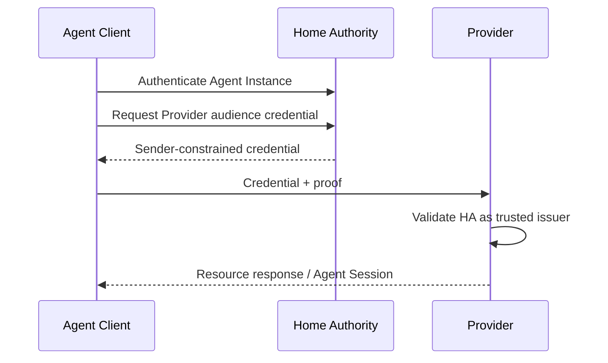
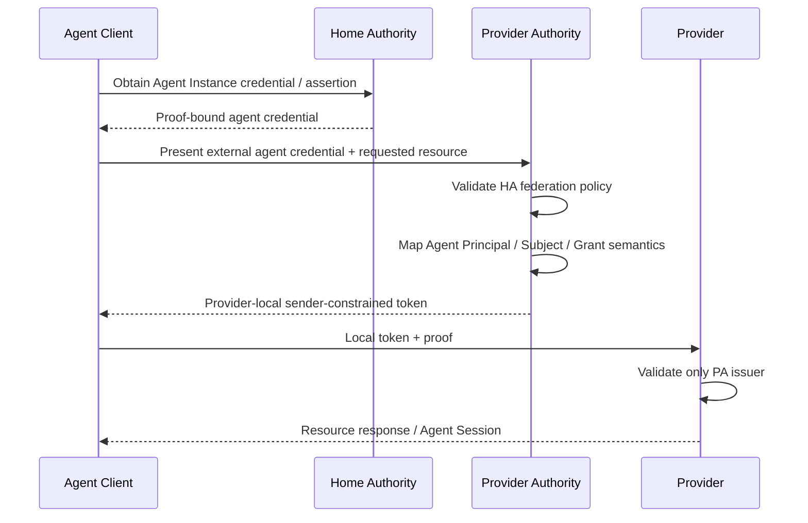

# Provider and Authority Trust Model

## Problem

A global AgentAuth protocol cannot assume every Provider will validate tokens from every Agent Authority directly.

A Provider may want:

- one local Authorization Server
- a short list of enterprise issuers
- federation with selected external Trust Domains
- no direct relationship with arbitrary agent publishers

AgentAuth therefore supports two issuer topologies.

## Topology A: Direct issuer trust

The Provider directly accepts credentials issued by the Agent Principal's Authority.



Use when:

- Provider and Authority are in one organization
- Provider explicitly trusts a small external issuer set
- private ecosystem or bilateral federation exists

Advantages:

- fewer exchanges
- lower latency
- direct provenance

Costs:

- Provider maintains external issuer trust
- Provider must understand accepted foreign claims/profiles

## Topology B: Provider-Authority brokered exchange

The Provider trusts a local Provider Authorization Server.

The Agent Client authenticates using an accepted Home Authority credential, then the Provider Authorization Server exchanges or federates that credential into a Provider-local access credential.



Use when:

- public SaaS Provider does not want arbitrary issuer logic inside each Resource Server
- enterprise identity architecture centralizes federation at an Authorization Server
- Provider needs local claims, consent, risk, or tenant mapping before access

Advantages:

- Resource Server trusts fewer issuers
- local claims and policy are normalized
- federation logic stays in one control point

Costs:

- extra network exchange
- Provider Authority becomes part of the availability path for new authorization
- subject/actor semantics must survive translation exactly

## Home Authority

A Home Authority is the issuer responsible for authenticating the Agent Principal or Agent Instance in its native Trust Domain.

Home Authority does not imply global trust.

## Provider Authority

A Provider Authority is an Authorization Server trusted by the Provider Resource Server.

The same deployment MAY be both Home Authority and Provider Authority.

## Discovery

Provider resource metadata lists Authorization Servers accepted for that resource.

An Agent Client computes:

```text
acceptable_authorities =
    Provider advertised authorities
    INTERSECT
    Agent owner / enterprise trust policy
```

If the Agent's Home Authority is directly acceptable, Topology A is possible.

If not, an advertised Provider Authority MAY support federation or credential exchange from the Home Authority.

No intersection means authentication cannot continue without explicit trust configuration.

## Token exchange role

OAuth Token Exchange is especially useful at the Authority boundary in Topology B.

The input credential may establish the external Agent Actor and Instance.

The output credential is:

- issued by the Provider Authority
- audience restricted to the Provider Resource
- sender constrained
- normalized to the Provider's AgentAuth profile
- no broader than the incoming and locally granted authority

## Important qualification

AgentAuth does not require Token Exchange for every delegated request.

There are two different situations:

### Stored delegation at one Authority

The Authority already has an approved Delegation Grant for the Subject and Agent.

It can issue a resource credential from that grant according to its OAuth authorization model without exposing a reusable human token to the Agent Client.

### Credential exchange across boundaries

The Agent Client or Provider Authority has an existing credential that must be transformed for a new trust domain or audience.

Token Exchange is appropriate here.

This distinction prevents an implementation from forcing raw Subject credentials into an agent runtime merely to satisfy a conceptual token-exchange diagram.

## Subject and Actor preservation

A brokered exchange MUST preserve:

- represented Subject, if any
- current Agent Actor
- Agent Instance identity
- delegation or grant reference where required
- authority mode: direct or delegated
- proof binding

The Provider Authority MUST NOT translate:

```text
Subject=user, Actor=agent
```

into:

```text
Subject=user
```

because doing so destroys the security property that the Provider knows an agent is acting.

## Claim normalization

A Provider Authority may map foreign extension claims into local AgentAuth versions.

Mapping rules:

- unknown mandatory security semantics fail closed
- local claims may narrow authority
- issuer provenance remains auditable
- local assurance interpretation may stay equal or become more conservative
- grant expiry may shorten
- delegation depth may decrease
- action/resource scope may narrow

Mapping MUST NOT broaden authority.

## Provider signup under brokered trust

A public Provider can implement signup without trusting every Home Authority at the application layer.

```text
Agent -> Home Authority
      -> Provider Authority federation/exchange
      -> signup-scoped Provider token
      -> Provider signup endpoint
      -> local Agent Account
```

The Provider Account stores the locally accepted Agent Principal mapping plus provenance needed to reconstruct which external issuer was trusted.

## Provider login under brokered trust

After signup, login can still require a fresh Agent Instance proof.

A persistent Provider Agent Account is not a bearer credential.

```text
Agent Account
  identifies relationship

Fresh AgentAuth credential
  proves current runtime

Provider policy
  decides current access
```

## Revocation

### Home Authority revocation

A compromised Agent Instance can be revoked at the Home Authority.

Provider Authority federation SHOULD honor revocation according to configured freshness.

### Provider-local revocation

The Provider can independently:

- disable local Agent Account
- deny one Agent Principal
- terminate Agent Sessions
- remove issuer trust
- revoke local grants

Provider-local denial wins even when Home Authority still considers the agent active.

## Availability

Existing short-lived Provider-local access tokens MAY remain locally verifiable while federation services are temporarily unavailable, according to Provider risk policy.

New cross-domain authorization SHOULD fail closed when current trust cannot be established for high-risk operations.

## Normative trust references

This topology document is refined by:

- `docs/40-trust-domain-model.md`
- `docs/41-federation-protocol.md`
- `docs/45-federated-token-exchange.md`
- `docs/46-trust-decision-algorithm.md`

Runtime Attestation is defined separately in `docs/43-runtime-attestation.md`.

## Security invariant

The trust graph is explicit.

```text
Agent identity valid
    does not imply
Provider trusts issuer

Provider trusts issuer
    does not imply
Agent has permission

Agent has permission
    does not imply
every action is currently allowed
```
