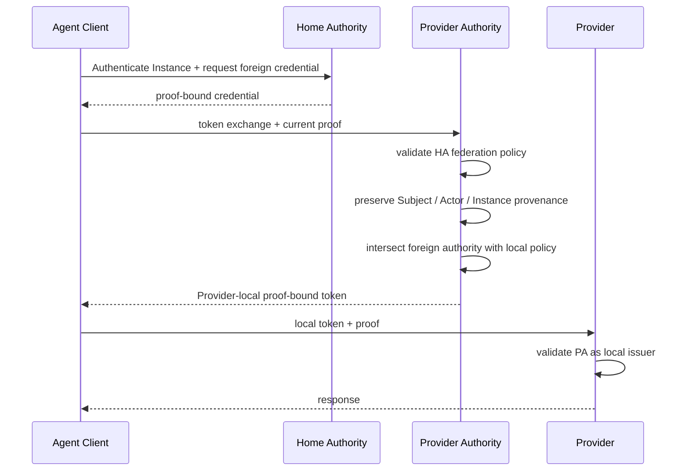

# AgentAuth v0.2 Federated Token Exchange

## 1. Goal

Brokered federation lets a Provider Authority convert accepted foreign identity and authorization evidence into a Provider-local, sender-constrained credential.

OAuth Token Exchange is the preferred standards mechanism when an existing credential is being exchanged across trust or audience boundaries.

## 2. Parties

- Agent Client
- Home Authority
- Provider Authority
- Provider Resource Server

## 3. Sequence



## 4. Input requirements

The Provider Authority MUST establish:

- foreign issuer is an active Federation Peer
- input credential is valid
- current Agent Instance proves possession
- target Provider Resource is permitted
- delegated Subject is acceptable when present
- grant provenance is acceptable
- protocol version is supported
- required attestation policy is satisfied

## 5. Output requirements

The output credential MUST:

- be issued by the Provider Authority
- be audience-bound to the Provider Resource
- be sender-constrained
- preserve canonical Agent identity provenance
- preserve Agent Instance identity
- preserve Subject and Actor distinction
- identify delegated mode when applicable
- not exceed foreign authority
- not exceed Provider-local authority

## 6. Provenance

Brokered exchange changes the token issuer, not the canonical Agent identity.

Example:

```text
output iss:
  https://auth.provider.example

agent_issuer:
  https://agents.foreign.example

agent_id:
  agent_123
```

The local token issuer and Home Authority are intentionally different fields.

## 7. Subject preservation

Delegated input:

```text
Subject = user_789
Actor   = agent_123
```

Output MUST preserve equivalent semantics.

Flattening to:

```text
Subject = user_789
```

is non-conforming.

## 8. Attenuation

Let foreign authority be F and Provider-local maximum authority be L.

The output authority O MUST satisfy:

```text
O <= F
O <= L
```

where `<=` means equal or narrower under the AgentAuth capability and constraint model.

The exchange cannot union F and L.

## 9. Trust translation

A Provider Authority may translate assurance semantics only when the mapping is configured.

Example:

```text
foreign:
  runtime assurance = hardware-backed profile X

local mapping:
  satisfies local class "high-integrity-runtime"
```

The Provider Authority MUST NOT claim a stronger local assurance result than the configured mapping supports.

## 10. Grant references

A local output token may carry a Provider-local grant reference.

If it does, audit provenance must retain linkage to the upstream authorization basis.

The raw foreign grant or token does not need to be embedded.

## 11. Refresh

A Provider-local refresh mechanism, if allowed, MUST remain bounded by:

- foreign grant lifetime
- foreign issuer trust
- local grant lifetime
- local Provider policy
- Agent Instance status
- current proof-key binding

Loss of federation trust must block creation of new local credentials.

## 12. Revocation

The Provider Authority needs a strategy for upstream revocation freshness.

Options include:

- short input credential lifetime
- introspection
- revocation events
- grant-status checks
- bounded cached validity

The selected strategy must match the risk profile.

## 13. Failure behavior

Exchange fails when:

- foreign issuer is no longer trusted
- Agent proof fails
- audience is not permitted
- Subject/Actor semantics are ambiguous
- required attestation is unavailable
- foreign authority cannot be safely mapped
- local policy would broaden authority
- mandatory extension is unknown

## 14. Direct trust remains valid

Federated Token Exchange is not required when the Provider directly trusts the Home Authority.

It is a trust-topology tool, not a mandatory extra hop.
