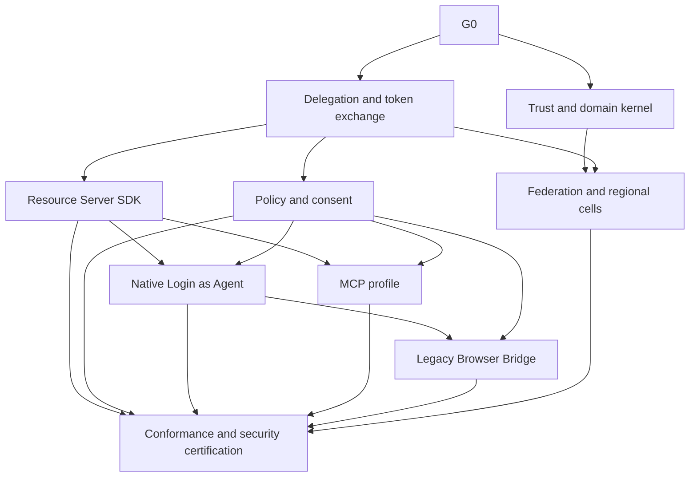

# ZzzOps Product Goal DAG

## Canonical top-level outcome

G0: Deliver a production-capable Agent Authentication and Delegation platform in which AI agents are first-class cryptographic actors, can receive attenuated authority from humans or organizations, can access APIs, MCP servers, and browser applications, and remain explicitly auditable and revocable.

## DAG

## G1 Trust and domain kernel

Deliver:

- Trust Domain
- Agent Definition
- Agent Principal
- Agent Instance
- key lifecycle
- metadata and identifiers
- audit envelope

Acceptance:

- independent Agent Instance revocation
- issuer-key rotation
- stable Actor identity

## G2 Delegation and token exchange

Depends on: G1

Deliver:

- grants
- attenuation
- token exchange
- DPoP/mTLS binding
- revocation

Acceptance:

- Subject and Actor remain separate
- child grant cannot widen authority
- audience-bound credentials

## G3 Resource Server SDK

Depends on: G2

Deliver:

- validation middleware
- local request context
- gateway header protection
- audit integration

Acceptance:

- integrated API can reliably identify AI Agent Actor

## G4 Policy and consent

Depends on: G2

Deliver:

- structured consent
- policy decision API
- step-up
- Action Digest

Acceptance:

- exact transaction approval
- fail-closed high-risk policy

## G5 Native Login as Agent

Depends on: G3, G4

Deliver:

- session bootstrap
- server-side agent session
- revocation
- UI sample

Acceptance:

- target can distinguish agent browser session from human session

## G6 MCP profile

Depends on: G3, G4

Deliver:

- MCP auth integration
- tool action mapping
- scope step-up

Acceptance:

- MCP shares same grant source of truth

## G7 Legacy Browser Bridge

Depends on: G5, G4

Deliver:

- isolated browser
- secret injection
- Action Guard
- human handoff
- adapters

Acceptance:

- no secret exposure to model
- no false claim of target-side awareness

## G8 Federation and regional cells

Depends on: G1, G2

Deliver:

- regional deployment
- Trust Domain federation
- SPIFFE bridge
- sovereign profile

Acceptance:

- no mandatory global root
- explicit cross-domain trust

## G9 Conformance and security certification

Depends on all user-facing execution paths.

Deliver:

- protocol conformance
- property tests
- fuzzing
- red-team suite
- operational release gates

Acceptance:

- all security invariants executable and green
